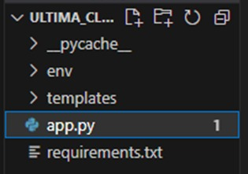

# flaskIntegral
Trabajo integral de flask - PPI ITEC 2023.
## Tabla de contenidos
- [Entorno Virtual e Inicio](#entorno-Virtual-e-Inicio)
- [Templates](#templates)
- [Migraciones](#migraciones)
- [Manejo de datos](#manejo-de-datos)


## *Entorno Virtual e Inicio*
***
**Paso 1.**

Crear entorno virtual de python en Linux.

```
python3 -m venv venv
```

El segundo *venv* es el nombre del entorno (Se puede poner otro).

**Paso 2.**

Activar entorno virtual.

```
source venv/bin/activate
```

**Paso 3.**

Dentro del entorno, levantar el archivo requirements.txt que contiene las dependencias necesarias para poder trabajar.

```
pip install -r requirements.txt
```

**Paso 4.**

Crear un archivo app.py a la altura del entorno virtual desde Visual Studio Code.



**Paso 5.**
 
Crear instancia de FLASK

```python 
from flask import (
 Flask
)

app = Flask(__name__)
```

**Paso 6.**

Iniciar servidor
```
flask run --reload
```

**Paso 7.**

Crear una ruta

```python 
@app.route('/')
def index():
    return "<h1> Hola Flask </h1>"
```

## *Templates*
***
### **Creacion.**

A la misma altura de la carpeta se crea la carpeta *templates* de donde se tomaran todos los archivos HTML a los cuales se vincularan las distintas rutas.


Posteriormente, importo *render_template* de Flask

```python 
from flask import (
    render_template
)

```

Realizado esto, se modifica la ruta en el archivo app.py

```python 
@app.route('/')
def index():
    return render_template('index.html')
```

### **Utiles - Jinja.**

- Hacer extension.
```html

```
- Crear bloque
```html
  
```
- Bucle for
```html
 
 ejemplo

```

### **Context Procesor**

Dentro de *app.py*, creo el siguiente metedo:

```python 
@app.context_processor
def inject_mensaje():
    mensaje = "Bienvenido al ITEC"
    return dict(
        mensaje = mensaje
    )
```

Todo el contenido del diccionario definido en este metodo se puede citar en cualquier template.

## *Migraciones*
***
**Paso 1.**
Iniciar XAMPP desde terminal de linux (Tengo creado el atajo)

```
xampp_start
```

**Paso 2.**

Hacer las importaiones necesarias en archivo *app.py*.

```python 
from flask_migrate import Migrate
from flask_sqlachemy import SQLAlchemy
from sqlalchemy import ForeignKey
```
**Paso 3.**

Armo la estructura que usa Alchemy para hacer la conexion con la base de datos en el archivo *app.py*.

```python 
#mysql+pymysql://usuario:contraseña@ip/nombre_db
app.config["SQLALCHEMY_DATABASE_URI"] = "mysql+pymysql://root:@localhost/alchemy"
```
donde *root* es el usuariuo, no hay contraseña, *localhost* es la ip y *alchemy* es el nombre de la base en este ejemplo.

**Paso 4.**

Realizada la conexion, necesito generar una instancia de SQLAlchemy y una instancia de Migrate en *app.py*.

```python 
db = SQLAlchemy(app)
migrate = Migrate(app, db)
```
**Paso 5.**

Inicio el modelo de migraciones

```python 
flask db init
```
Esto se hace por unica vez y crea todas las carpetas necesarias para trabajar.

**Paso 6. (Ejemplo)**

Creo una clase la cual luego va a ser importada y queda definida como una tabla de la base de datos.

```python 
class Pais(db.Model):
    __tablename__ = "pais"
    id = db.Column(db.Integer, primary_key = True)
    nombre = db.Column(db.String(100), nullable=False)

    def __str__(self):
        return self.name
```

**Paso 7.**

Generar migracion que cargue en la base de dato la tabla creada.

```python 
flask db migrate -m "Descripcion de migracion"
```
Realizado esto, se actualiza para que aparezca.
```python 
flask db upgrade
```
**Paso 8. (Ejemplo)**

Genero otra tabla para vincular con la anterior usando la clave foranea.

```python 
class Provincia(db.Model):
    __tablename__ = "provincia"
    id = db.Column(db.Integer, primary_key = True)
    nombre = db.Column(db.String(100), nullable=False)
    pais = db.Column(
        db.Integer,
        ForeignKey("pais.id"),
        nullable=False )

    def __str__(self):
        return self.name
```

Repito Paso 7.

## *Manejo de datos*
***

**Paso 1**

Hago las importaciones necesarias para el manejo de datos.

```python 
from flask import (
    request,
    readirect,
    url_for,
)
```

**Paso 2 - Ejemplo**
### Carga de datos

Creo en el archivo *app.py* la ruta a la cual van a ir los datos cargados y le asigno el metodo por el cual va a recibir los datos. 

```python 
@app.route("/agregar_pais", methods=["POST"])
def nuevo_pais():
    if request.method=="POST":
        nombre_pais = request.form["nombre"]

        # Inicializo el objeto. 
        nuevo_pais = Pais(nombre=nombre_pais)
        
        # Preparo el objeto para enviarlo a la base de datos. Hago la conexion a la base de datos. Alchemy detecta que es un objeto Pais, entonces ya sabe que tiene que mandarlo a la base de datos en la tabla "PAIS".
        db.session.add(nuevo_pais)

        # Envio el objeto y queda almacenado
        db.session.commit()

        # Esto es para que vuelva a la pagina de inicio una vez que se cargo el objeto.
        return redirect(url_for("index"))
```

**Paso 3**

Defindo en algun template un formulario, que es la herramienta del front que se va a usar para mandar los datos al back.

```html
<form action="/agregar_pais" method="POST">
    <input type="text" name="nombre">
    <button type="submit">Guardar</button>
</form>
```
En este caso:

*action* : Marca la ruta a la cual se van a enviar los datos, que es la ruta definida en el paso 2.

*method*: Es el metodo seleccionado para hacerlo, el cual tambien tiene que ser coincidente con el metodo definido en paso 2 para recibir.

*button type*: Debe ser *submit* para poder enviar los datos.

*name*: es el nombre del formulario, que es la identificacion que va a usar el *request* para acceder.

**Paso 4 - Ejemplo**
### Eliminacion de datos

```python 
@app.route("/borrar_pais/<id>")
def borrar_pais(id):
    # Obtengo el pais que quiero eliminar.
    pais= Pais.query.get(id) 

    # Elimino.
    db.session.delete(pais)

    # Guardo los datos
    db.session.commit()

    return redirect(url_for("index"))
```

En este caso:

Como parametro de *app.route* no solo mando la direccion a la cual se dirige, sino que tambien le paso una variable que es la *id* de lo que quiero eliminar de la base de dato.
 
 Hace la eliminacion y vuelve a la pagina de inicio.
